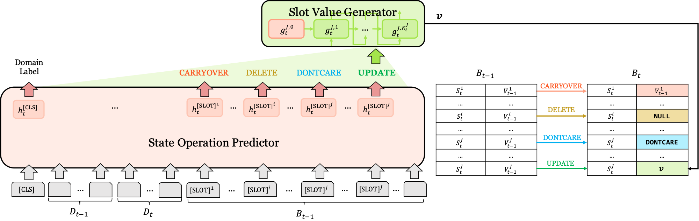

# SOM-DST

Convert code pytorch-transformers to huggingface transformers 

```
# Fixed Requirements

# pip install torch==1.7.1+cu110 -f https://download.pytorch.org/whl/torch_stable.html
torch==1.7.1+cu110
transformers==3.0.2
wget==3.2
jsonlines
tqdm
```

```
# 동일한 Parameter setting (MW 2.1) 성능 소폭 감소 (0.5309 -> 0.5275)
------------------------------
op_code: 4, is_gt_op: False, is_gt_p_state: False, is_gt_gen: False
Epoch 0 joint accuracy :  0.5275515743756786
Epoch 0 slot turn accuracy :  0.9732401375316211
Epoch 0 slot turn F1:  0.9175307139165523
Epoch 0 op accuracy :  0.9737830256966589
Epoch 0 op F1 :  {'delete': 0.018656716417910446, 'update': 0.8015826338020638, 'dontcare': 0.3235668789808917, 'carryover': 0.9862940159245958}
Epoch 0 op hit count :  {'delete': 15, 'update': 7496, 'dontcare': 127, 'carryover': 207607}
Epoch 0 op all count :  {'delete': 1576, 'update': 10595, 'dontcare': 581, 'carryover': 208288}
Final Joint Accuracy :  0.3713713713713714
Final slot turn F1 :  0.9101975987924662
Latency Per Prediction : 24.244383 ms
-----------------------------
```

## The original readme.md is as follows 

This code is the official pytorch implementation of [Efficient Dialogue State Tracking by Selectively Overwriting Memory](https://arxiv.org/abs/1911.03906).<br>
> [Sungdong Kim](https://github.com/dsksd), [Sohee Yang](https://github.com/soheeyang), [Gyuwan Kim](mailto:gyuwan.kim@navercorp.com), [Sang-woo Lee](https://scholar.google.co.kr/citations?user=TMTTMuQAAAAJ)<br>
> In ACL 2020.

<p align="left"></p>


## Requirements

```
python3.6
pytorch-transformers==1.0.0
torch==1.3.0a0+24ae9b5
wget==3.2
```

## Download and Preprocessing data

To download the MultiWOZ dataset and preprocess it, please run this script first.<br>
You can choose the version of the dataset. ('2.1', '2.0')<br>
The downloaded original dataset will be located in `$DOWNLOAD_PATH`, and after preprocessing, it will be located in `$TARGET_PATH`.
```
python3 create_data.py --main_dir $DOWNLOAD_PATH --target_path $TARGET_PATH --mwz_ver '2.1' # or '2.0'
```


## Model Training

To train the SOM-DST model, please run this script. <br>
`$DATASET_DIR` is the root directory of the preprocessed dataset, and `$SAVE_DIR` is output directory that best_model's checkpoint will be saved. <br>
This script contains the downloading process of pretrained-BERT checkpoint depending on `--bert_ckpt_path`. `--bert_ckpt_path` should contain either `base` or `large`. 


```
python3 train.py --data_root $DATASET_DIR --save_dir $SAVE_DIR --bert_ckpt_path `bert-base-uncased-pytorch_model.bin --op_code '4'`
```

You can choose the operation set from various options via `--op_code`. The default setting is `'4'`.

```python
OP_SET = {
    '2': {'update': 0, 'carryover': 1},
    '3-1': {'update': 0, 'carryover': 1, 'dontcare': 2},
    '3-2': {'update': 0, 'carryover': 1, 'delete': 2},
    '4': {'delete': 0, 'update': 1, 'dontcare': 2, 'carryover': 3},
    '6': {'delete': 0, 'update': 1, 'dontcare': 2, 'carryover': 3, 'yes': 4, 'no': 5}
}
```


## Model Evaluation

If you want to evaluate the already trained model, you can run this script. <br>
`$MODEL_PATH` is the checkpoint of the model used for evaluation, and `$DATASET_DIR` is the root directory of the preprocessed dataset. <br>
You can download the pretrained SOM-DST model from [here](https://drive.google.com/file/d/1letiJzYtaul0w5xAJr7LRmjIyhYy8hiy/view?usp=sharing).

```
python3 evaluation.py --model_ckpt_path $MODEL_PATH --data_root $DATASET_DIR
```

```
--gt_op: give the ground-truth operation for the evaluation.
--gt_p_state: give the ground-truth previous dialogue state for the evaluation.
--gt_gen: give the ground-truth generation for the evaluation.
--eval_all: evaluate all combinations of these.
```

### Sample output of evaluation

```
------------------------------
op_code: 4, is_gt_op: False, is_gt_p_state: False, is_gt_gen: False
Epoch 0 joint accuracy :  0.5309446254071661
Epoch 0 slot turn accuracy :  0.9736020629749801
Epoch 0 slot turn F1:  0.9171910941855902
Epoch 0 op accuracy :  0.9741675714802285
Epoch 0 op F1 :  {'delete': 0.030501089324618733, 'update': 0.7959107608753526, 'dontcare': 0.3029556650246305, 'carryover': 0.9864975897034028}
Epoch 0 op hit count :  {'delete': 21, 'update': 7474, 'dontcare': 123, 'carryover': 207712}
Epoch 0 op all count :  {'delete': 1341, 'update': 10745, 'dontcare': 624, 'carryover': 208330}
Final Joint Accuracy :  0.37037037037037035
Final slot turn F1 :  0.9108339131790647
Latency Per Prediction : 24.461546 ms
-----------------------------

hotel 0.5154559505409583 0.973776403915519
train 0.7171922685656155 0.9874646772917451
restaurant 0.6596113809854268 0.9857737682165246
attraction 0.66872174270448 0.9873270311001585
taxi 0.5903426791277259 0.9803219106957396

```

### Main results on MultiWOZ dataset (Joint Goal Accuracy)


| Model         | MultiWOZ 2.0 | MultWOZ 2.1 |
| ------------- | ------------ | ----------- |
| SOM-DST Base  | 51.72        | 53.01       |
| SOM-DST Large | 52.32        | 53.68       |


## Citation


```bibtex
@inproceedings{kim2020somdst,
  title={Efficient Dialogue State Tracking by Selectively Overwriting Memory},
  author={Kim, Sungdong and Yang, Sohee and Kim, Gyuwan and Lee, Sang-woo},
  booktitle={ACL},
  year={2020}
}
```


## Contact

If you have any questions, feel free to contact Sungdong Kim ([sungdong.kim@navercorp.com](mailto:sungdong.kim@navercorp.com)) and Sohee Yang ([sh.yang@navercorp.com](mailto:sh.yang@navercorp.com))


## License

```
Copyright (c) 2020-present NAVER Corp.

Permission is hereby granted, free of charge, to any person obtaining a copy
of this software and associated documentation files (the "Software"), to deal
in the Software without restriction, including without limitation the rights
to use, copy, modify, merge, publish, distribute, sublicense, and/or sell
copies of the Software, and to permit persons to whom the Software is
furnished to do so, subject to the following conditions:

The above copyright notice and this permission notice shall be included in all
copies or substantial portions of the Software.

THE SOFTWARE IS PROVIDED "AS IS", WITHOUT WARRANTY OF ANY KIND, EXPRESS OR
IMPLIED, INCLUDING BUT NOT LIMITED TO THE WARRANTIES OF MERCHANTABILITY,
FITNESS FOR A PARTICULAR PURPOSE AND NONINFRINGEMENT. IN NO EVENT SHALL THE
AUTHORS OR COPYRIGHT HOLDERS BE LIABLE FOR ANY CLAIM, DAMAGES OR OTHER
LIABILITY, WHETHER IN AN ACTION OF CONTRACT, TORT OR OTHERWISE, ARISING FROM,
OUT OF OR IN CONNECTION WITH THE SOFTWARE OR THE USE OR OTHER DEALINGS IN THE
SOFTWARE.
```
